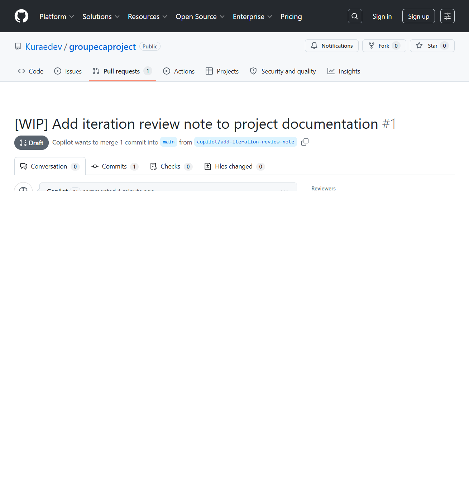

# Week 1-5 GitHub History Evidence

This is the GitHub-visible version of the Weeks 1-5 evidence. It mirrors the rendered report and keeps the commit history and pull request evidence readable directly in the repository.

## Summary

| Metric | Value | Notes |
|---|---:|---|
| Total commits | 35 | All commits from repository creation to 2026-05-10 |
| Week 1 commits | 11 | Setup, initial docs, and foundation work |
| Week 2 commits | 11 | Design, evidence, and documentation refinement |
| Week 3 commits | 5 | Evidence updates and Week 3 planning |
| Week 4 commits | 8 | MCP server implementation, performance improvements, and documentation |
| Pull requests | 1 | Live PR created for review evidence |

## Page 1: Network Timeline

| Date | Author | Commit | Commit hash |
|---|---|---|---|
| 2026-04-15 | Jake Cardenas | Create index.html with basic HTML structure | `60ab7de` |
| 2026-04-15 | Jake Cardenas | Delete index.html | `bc8a413` |
| 2026-04-23 | Jake Cardenas | docs: initialize README with project overview, repo structure, and team info | `2b0d4fc` |
| 2026-04-24 | Jake Cardenas | docs: simplify README to plain readable format | `75668fb` |
| 2026-04-24 | Jake Cardenas | docs: add PRD with requirements written in plain language | `70bb44f` |
| 2026-04-24 | Jake Cardenas | docs: add complete PRD with functional requirements, NFRs, and acceptance criteria | `904e936` |
| 2026-04-24 | Jake Cardenas | docs: add agents.md with tech stack, 4 agent roles, architecture conventions, and requirements mapping | `9106c96` |
| 2026-04-24 | Jake Cardenas | Add new developers to the team section | `688cdf9` |
| 2026-04-24 | Jake Cardenas | Add Michaeljosh39 to the list of developers | `0d0d8a6` |
| 2026-04-24 | JakeCardenas | Update README with new changes | `cb0eb8c` |
| 2026-04-28 | JakeCardenas | feat: complete portfolio frontend with hero, skills, experience, projects, and contact sections | `76bb7f` |
| 2026-05-08 | Rhys Cristian T. Suyu | Add files via upload | `4c58f17` |
| 2026-05-08 | Rhys Cristian T. Suyu | Update README.md | `8956826` |
| 2026-05-08 | Rhys Suyu | Fix: Restore Next.js app and integrate portfolio with digital twin | `a358a2f` |
| 2026-05-08 | Rhys Suyu | Fix: Correct team identity from Group 3 to Group 2 across system prompt, database init, and API fallbacks | `86400a3` |
| 2026-05-09 | Rhys Suyu | Restore chat API, questions route, and portfolio build integration | `08b6dc3` |
| 2026-05-09 | Rhys Suyu | Update deployment URL and add Vercel link to all documentation and portfolio | `e1c3523` |
| 2026-05-09 | Rhys Suyu | Redesign UI with dark purple/magenta theme - mobile-first responsive chat interface matching design mockup | `a85dca2` |
| 2026-05-09 | Rhys Suyu | Fix CSS syntax error - remove orphaned properties in globals.css | `e9d6a8f` |
| 2026-05-09 | Rhys Suyu | Enhance UI with better text visibility, effects, and transitions - add shadows, hover effects, improved contrast | `111172e` |
| 2026-05-09 | Rhys Suyu | Fix chat theme overrides and keep purple/white styling consistent | `5f71b7c` |
| 2026-05-09 | Rhys Suyu | Update Vercel deployment URL from groupecaproject to grouptwodigitaltwin across all documentation and components | `fd194e4` |
| 2026-05-10 | Rhys Suyu | refactor: restructure README with About section and move Vercel link | `62da327` |
| 2026-05-10 | Rhys Suyu | chore(docs): add ClickUp-style board mock for evidence screenshot | `71ed3e1` |
| 2026-05-10 | Rhys Suyu | chore(docs): add Markdown ClickUp board evidence for GitHub visibility | `ab7383c` |
| 2026-05-10 | Rhys Suyu | docs: add repository structure to README and confirm docs links | `ca1881e` |
| 2026-05-10 | Rhys Suyu | docs: add design plan and week 2 evidence artifacts | `53f552c` |
| 2026-05-10 | Rhys Suyu | docs: update evidence to track week 3 progress and remove submission checklist | `6b842ae` |
| 2026-05-10 | Rhys Suyu | docs: update evidence file formatting | `92202fb` |
| 2026-05-10 | Rhys Suyu | docs: update clickup board evidence | `6781d1a` |
| 2026-05-10 | Rhys Suyu | Update week2-github-history-cristian-suyu.md | `19742a8` |
| 2026-05-10 | Rhys Suyu | feat: add MCP server scaffold with chat, interview, and portfolio tools | `a85d037` |

## Page 2: Commit List with Authors

The table above is the commit list. It is intentionally kept in repository order so the history is continuous and easy to audit.

## Page 3: Pull Request Evidence

**PR URL:** https://github.com/Kuraedev/groupecaproject/pull/1

**Title:** `[WIP] Add iteration review note to project documentation`

**Status:** Draft PR with a visible commit and comment trail

**Head branch:** `copilot/add-iteration-review-note`

The screenshot above shows the GitHub pull request page, including the PR navigation tabs and activity needed for submission evidence.
